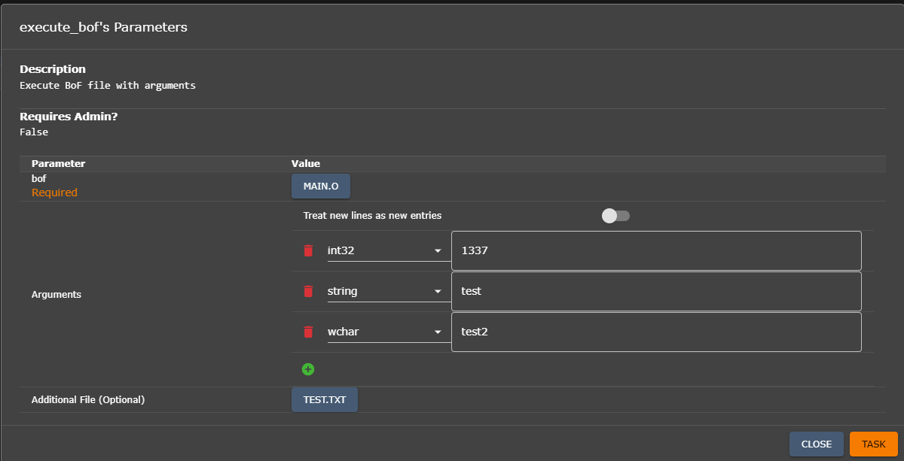

+++
title = "Hannibal"
chapter = true
weight = 100
+++

## `execute_bof`: Execute Beacon Object File from Hannibal agents

This command is developed for executing Beacon Object File in the Hannibal agents, with a flexible additional arguments, or additional payloads. 

### Beacon Object File (BOF)

Beacon Object File (BOF), at its core, is in the format of an object file. This file is created during the *compilation* process when C/C++ compiler convert source code into executable binaries. 


These object files contains information about functions in the binaries, imports/exports, and also implementations of those functions. Object files in general are not supposed to run as a program, but as inputs for linker to create an executable file. Therefore, the file size of an object file is relatively much smaller comparing to final executable.

```
PS ls .\hannibal.o                                                                                                     
    Directory: ...

Mode                 LastWriteTime         Length Name
----                 -------------         ------ ----
-a---            4/7/2025 11:19 PM          36652 hannibal.o

PS ls ..\hannibal.exe                                                                                                           
    Directory: ...

Mode                 LastWriteTime         Length Name
----                 -------------         ------ ----
-a---           4/17/2025 11:04 AM        1064378 hannibal.exe

```
When an object file is weaponized to include implementations of malicious functions, it becomes a Beacon Object File. When we say "run a BOF", it means that we are doing the job of a linker. Our implementation of `execute_bof` in Hannibal is doing the exact same thing: parsing the defined functions, link the import tables to the correct function at runtime, etc.; and finally, execute it with the functions defined inside. 

### Why BOF? 

As you may noticed, there is one another function in Hannibal agent: `execute_hbin`, which receives shellcode to achieve the same thing: running some fileless payload. Here is a quick comparison between Beacon Object File and shellcode. 

| Functions          | Strengths                                                                                                                                                                                                  | Weaknesses                                                                                                                                                                              |
| ------------------ | ---------------------------------------------------------------------------------------------------------------------------------------------------------------------------------------------------------- | --------------------------------------------------------------------------------------------------------------------------------------------------------------------------------------- |
| **`execute_bof`**  | + Quick development, directly derived from normal C/C++ compilation.<br>+ A lot of open source BOFs are ready to test & modify.<br>+ Easy change the structs/parameters/etc. as we need during operations. | + Need a COFF loader.<br>+ May drop more signatures for detection.                                                                                                                      |
| **`execute_hbin`** | + Full control to what we can do, as it is shellcode.<br>+ Smaller payload than BOFs<br>+ No COFF parser needed.<br>+ Porting BOFs to shellcode is relatively easy.                                        | + There are open-source BOFs already, require more work to port.<br>+ Very sensitive to struct changes during development of future Hannibal build.<br>+ Limitation of PIC shellcode 🫠 |

So, in general, the quick development, easy to use and build features of BOF will trade-off with somewhat more complexity in implementation of agent, which will increase the size of the Hannibal agent shellcode. However, we think that in some cases, we need complex operations, running a BOF will reduce our headache 🤯. 

## How to use 

To start, you can try with this [example BOF file](./attachments/sample_bof). The source code is in [main.c](./attachments/main.c). If this object file to be built as an executable, it will run like:

```powershell
main.exe <a_number> <a_string> <a_wstring> <file>
``` 

### Run the command

This is how you run the `execute_bof`. 

1. Get a callback from a victim :)
2. Next, you can run the `execute_bof` in the interaction with the callback. A GUI will display. 



There are 03 parameters: 

+ `bof` (Required): The BOF will be sent and executed. 
+ `Arguments`: Additional arguments. You can have as many arguments as you want (of course longer payload!), and at the moment there are 03 types that the `execute_bof` server side can host: 
  + `int32`: A signed 32-bit integer. 
  + `string`: A normal C-style string. 
  + `wchar`: A `wchar_t` string. 
+ `Additional File`: Additional file, could be served as the second stage payload. 

`Arguments` and `Additional File` are not required. However, for `Additional File`, due to some restriction in the mechanism of Hannibal shellcode agent to not having `NULL` payload, a random 16-byte gibberish will be added as a decoy. 

Next, just task it :D

### During the task 

Periodically, the victim's Hannibal agent will load new task. The task for `execute_bof` are loaded as this struct: 

```c
typedef struct _CMD_EXECUTE_BOF {
    PBYTE args;
    int argc;
    PBYTE bof;
    int bof_size;
    PBYTE file_content;
    int file_size;
} CMD_EXECUTE_BOF;
```

+ `PBYTE args`: the encoded arguments, in the order that you added. With the above example, the value of `args` will look like this (in bytes): 

```
|     int32      |       string       |        wchar         |
|\x39\x05\x00\x00|\x74\x65\x73\x74\x00|..............\x00\x00|   
```
+ `int argc`: the length of `args`, in bytes. 
+ `PBYTE bof`: the BOF file. 
+ `int bof_size`: size of the BOF file.
+ `PBYTE file_content`: the additional file. 
+ `int file_size`: the additional file's size.

Under the hood, the lifecycle of `execute_bof` could be summarized in this diagram: 


For the above test BOF, with above parameters, here is the response you get back: 


## Development & Debugging 

> I have discovered a truly marvelous documentation of this, which this margin is too narrow to contain. (h114mx001)

### Development 

To write a new BoF file, you will need...

### Debugging 

#### Before releasing the payload builder 

When you are trying to develop a BoF, you should: 

1. Building a Hannibal executable

+ Using the `debug_makefile` in `Payload_Type\hannibal\hannibal\agent_code\Hannibal`, to generate a Hannibal executable in `\bin\Hannibal.exe`.

```powershell
make -f ./debug_makefile
```
+ Remember to change the key in `Payload_Type\hannibal\hannibal\agent_code\Hannibal\include\config.h` into some key that is generated before by Mythic. 

```c
#define CONFIG_ENCRYPT_KEY { 245, 2, 183, 27, 24, 12, 93, 140, 124, 195, 36, 239, 248, 153, 211, 162, 204, 148, 127, 120, 146, 21, 13, 205, 219, 236, 53, 90, 152, 171, 79, 193 }
```

+ You can have one by navigating to `Payload` tab, selecting a generated Hannibal payload and convert the Base64 key into the `unsigned byte` C-style array.


2. Using debug toolings of your favorite to debug this `Hannibal.exe`. For us, we will use IDA Free. 

+ First, load the `Hannibal.exe` binary, and put a debugger breakpoint in `ObjectExecute+0x2A7`.
+ Debug it! Feels free :) 
+ Now, comeback to C2 server and task a `execute_bof`.
+ After a while, the debugger breakpoint will hit and you can map the source code to get source view. 


+ Step into the `call r10` instruction, now you have navigated to the BOF code! You can create function and do the debug as you want :)

#### Debugging the Hannibal shellcode payload

As Hannibal is a PIC shellcode, sometimes, very likely your BOF will get some restrictions, or you are developing it the wrong way, etc. Well..., this will get more tricky. For this task, my personal favorite workflow is:

+ Load the object file to IDA/Binja 

+ Use [`BlobRunner`](https://github.com/OALabs/BlobRunner) to load the shellcode, and use debugger (x64dbg/WinDbg/etc.) to debug BlobRunner
  + At the moment you load the source code, `BlobRunner` will show the entry point of the new thread for shellcode. Put a breakpoint there. 
  + The `call r10` instruction to get to BOF code is in `image_base + 0x5907` for our current build, you can get the base and calculate the address and put breakpoint there. 
  
+ Continue the shellcode loader, and if thing is getting well, you can get a debugger breakpoint :)

This is not likely the best workflow to debug Hannibal, or the BOF. But if it works it works :)